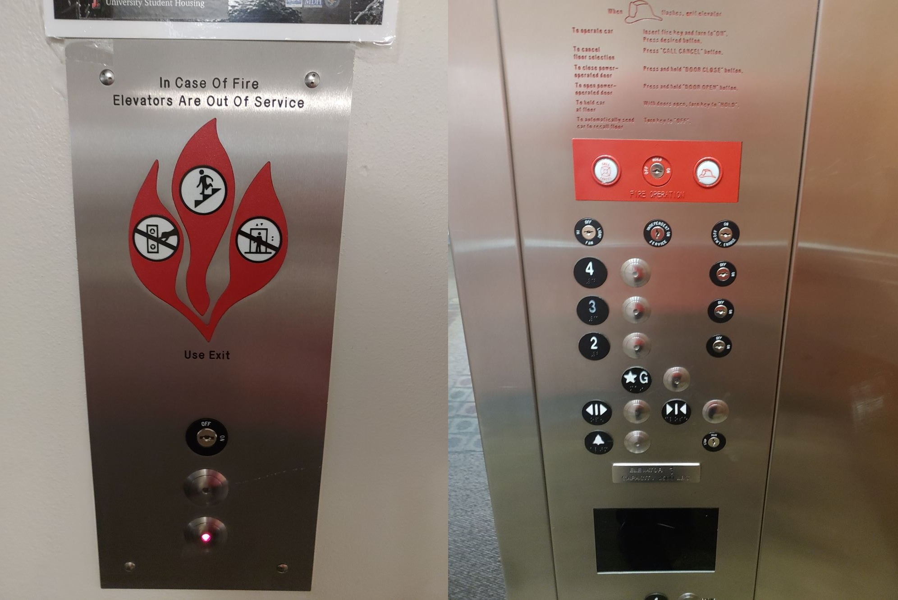
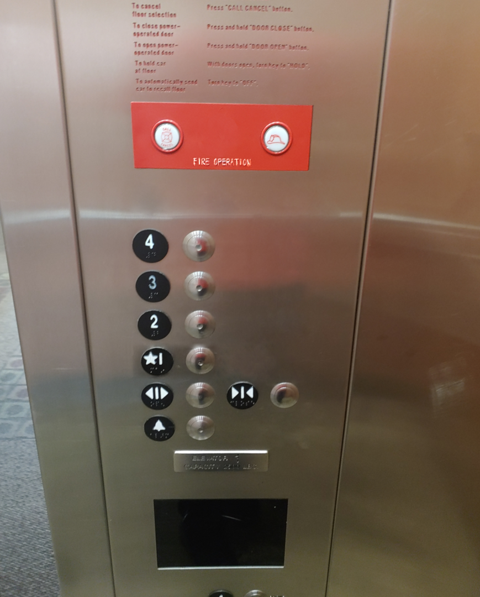
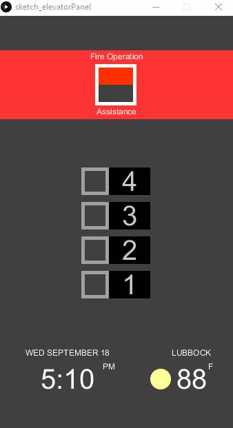

Links

DEMO{
  zip file of touch screen: https://github.com/LuisEduardoSandoval/ElevatorHomework1/blob/master/application.windows32.zip

  Source Code: https://github.com/LuisEduardoSandoval/ElevatorHomework1/blob/master/sketch_elevatorPanel.pde
 }
 
 Presentation Page: https://github.com/LuisEduardoSandoval/ElevatorHomework1/blob/master/README.md
 
 
 GitHub repository: https://github.com/LuisEduardoSandoval/ElevatorHomework1

Elevator from Murry Hall
Elevator Interface

Elevator Demonstration

Issues with current design

-The implemented elevator panel is uneven when distributing elevator button
  
-The large Key holes add un-neccesary visual noise to the panel 
  The issue adds clutter and may lead to problems with visibility when attempting to interact with the panel.
  
-The ground floor does not follow the logic of the panel
  The ground floor is designated with a G while the preceeding floors are designated by numbers. This destroys any consistancy and adds
  unwanted confusion to users by using letters.

-The Ground floor button is misplaced creating an unsatisfying Asthetic by adding visual noise.

  
Common uses for an elevator

-Accesing other floors

-Moving large objects when stairs are not accesibly

-Allowing thoes with disabilities to move floors

More Rare Uses

-Alert a Fire

-Ask for Assistance

Elevator and Interactions

generally a user will input for the elevator to elevate to the designated floor then proceed to input the desired floor.

The interface does make it simple to access the floors desired, however the visual clutter may add a bit of confusion when accesing the first floor, as it is designated by a G instead of the numerical values assigned to all other floors.

Elevator and feedback
Elevators provide feedback through the use of lights, buttons and signals.
The current design is visually unappealing and over cluttered from a design standpoint.

When developing an interface the issues faced from simplifying controls is oversimplification to the point where the user 
can no longer understand the panels original purpose, and removing useful information from the panel of which the minority of users need.

Possible Solution Sketch

The changes made applied to the first floor which is no longer designated as G, making it easier to understand and follows a pattern.
The chages made to fire Operations made it more readable for those who may not be able to see it or are color blind.
The removal of the Key holes allows the user to be less overcome by all uneccisary visual clutter as they serve no purpose for the user.

Designing a touch screen interface.

The desired screen size was 342,600
this was selected because a panel is taller than longer following that concept i created a panel with touch controls in processing
here is a still image of the current designed panel.

Here everything was simplified to the greatest extent possible without sacrificing understanding.
Aswell as detailing some useful information such as date, time, and weather.
The design here attempted to follow a cellphone of which many people use daily therefore making it a bit easier to understand as it is a well established UI.

which can be downloaded or taken from source code.
